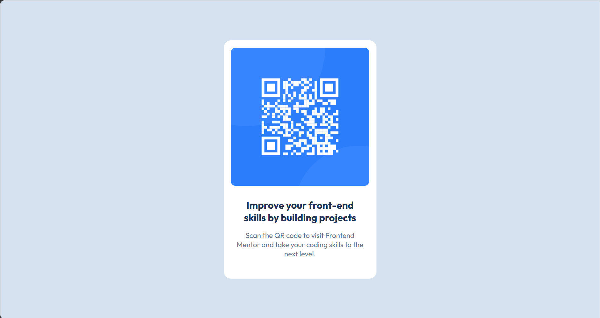

# Frontend Mentor - QR code component solution

This is a solution to the [QR code component challenge on Frontend Mentor](https://www.frontendmentor.io/challenges/qr-code-component-iux_sIO_H). Frontend Mentor challenges help you improve your coding skills by building realistic projects. 

## Table of contents

- [Overview](#overview)
  - [Screenshot](#screenshot)
  - [Links](#links)
- [My process](#my-process)
  - [Built with](#built-with)
  - [What I learned](#what-i-learned)
  - [Continued development](#continued-development)
  - [Useful resources](#useful-resources)
  - [AI Collaboration](#ai-collaboration)
- [Author](#author)

## Overview

A simple solution that shows the user a QR code that navigates to the Frontend Mentor website.

### Screenshot

### Links

- Solution URL: [GitHub Repository](https://github.com/jonathanbsousa/Front_End_Challenges)
- Live Site URL: [GitHub Pages](https://jonathanbsousa.github.io/Front_End_Challenges/)

## My process

- Build the HTML structure.
- Separate the styles into a different file.
- Apply the styles based on the references and the [style guide](./style-guide.md).
- Improve the responsive layout.
- Update the README.md file.

### Built with

- Semantic HTML5 markup
- CSS custom properties
- Flexbox

### What I learned

Not being anywhere near programming for 8 full months made me forget a lot of concepts and techniques. This challenge was very useful so I could come back to the basics and remember the fundamentals of programming.

The CSS styling was the struggling part. I was never good at it, but searching for some aspects of CSS properties gave me the idea that I could apply the same style for more than one container using the same selector at the start, and then apply different styles based on their second selector. 

### Continued development

Making a responsive layout is still a difficult aspect, and I want to focus on mastering that.

### Useful resources

- [CSS Units Guide](https://www.geeksforgeeks.org/css/css-units-em-rem-px-vh-vw/) - This helped me to distinguish the differences between the CSS units.

### AI Collaboration

I used Gemini to help me find any grammar mistakes that I might have made, and to help me with the responsive layout for some properties that I forgot. It went very well; everything was clear and helped me to understand some concepts and practice them.

## Author

- GitHub - [@jonathanbsousa](https://github.com/jonathanbsousa)
- Frontend Mentor - [@jonathanbsousa
](https://www.frontendmentor.io/profile/jonathanbsousa)
- Twitter - [@jhow_b_sousa](https://x.com/jhow_b_sousa)
